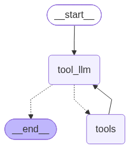

# LangGraph RAG Cardiology Assistant

Demo Recording:- https://drive.google.com/file/d/1E2iQ2sizjvv8M45I22S7ZXr54555_P8Z/view?usp=sharing


A cardiology-focused AI assistant built with LangGraph, FastAPI, and a C# WinForms desktop client. The agent uses a ReAct loop to query multiple medical knowledge sources and return synthesized answers.



## Architecture

```
CardioApp (C# WinForms)
        │
        │  POST /cardio  {"query": "..."}
        ▼
  FastAPI Server (main_app.py)
        │
        ▼
  LangGraph ReAct Agent
   ├── tool_llm  (Groq llama-3.1-8b-instant)
   └── tools
        ├── Wikipedia
        ├── Tavily Web Search
        └── PubMed
```

The agent loops between the `tool_llm` node (decides which tool to call) and the `tools` node (executes the call) until it has enough information to produce a final answer.

## Project Structure

```
langgraph-rag-cardioilogy/
├── main_app.py          # FastAPI server — exposes POST /cardio
├── main.py              # Quick CLI test runner
├── components/
│   ├── graph.py         # LangGraph graph definition
│   ├── state.py         # CardioState TypedDict
│   └── tools/
│       └── tools.py     # Wikipedia, Tavily, PubMed tool definitions
├── CardioApp/           # C# WinForms desktop frontend
│   ├── Form1.cs
│   └── Program.cs
├── cardio_graph.png     # Auto-generated graph diagram
├── pyproject.toml
└── requirements.txt
```

## Prerequisites

- Python >= 3.13
- [uv](https://docs.astral.sh/uv/) (recommended) or pip
- .NET SDK (for the WinForms client)
- API keys for Groq, Tavily, and LangSmith

## Setup

**1. Clone the repository**

```bash
git clone <repo-url>
cd langgraph-rag-cardioilogy
```

**2. Create a `.env` file** in the project root:

```env
GROQ_API_KEY=your_groq_api_key
TAVILY_API_KEY=your_tavily_api_key
LANGCHAIN_API_KEY=your_langsmith_api_key
```

**3. Install Python dependencies**

Using uv:
```bash
uv sync
```

Using pip:
```bash
pip install -r requirements.txt
```

## Running

**Start the FastAPI backend:**

```bash
python main_app.py
```

The server runs at `http://127.0.0.1:8080`.

**Test via CLI:**

```bash
python main.py
```

**Start the WinForms desktop client:**

Open `CardioApp/CardioApp.csproj` in Visual Studio and run, or:

```bash
cd CardioApp
dotnet run
```

Make sure the FastAPI backend is running before launching the desktop client.

## API

### `POST /cardio`

**Request:**
```json
{ "query": "Latest peer reviewed articles on atrial fibrillation" }
```

**Response:**
```json
{ "response": "..." }
```

## Tools

| Tool | Source | Purpose |
|------|--------|---------|
| `WikipediaQueryRun` | Wikipedia | General cardiology concepts |
| `TavilySearchResults` | Tavily Web Search | Recent news and articles |
| `pubmed_search` | PubMed | Peer-reviewed medical literature |

## API Keys

| Key | Where to get |
|-----|-------------|
| `GROQ_API_KEY` | [console.groq.com](https://console.groq.com) |
| `TAVILY_API_KEY` | [app.tavily.com](https://app.tavily.com) |
| `LANGCHAIN_API_KEY` | [smith.langchain.com](https://smith.langchain.com) |
